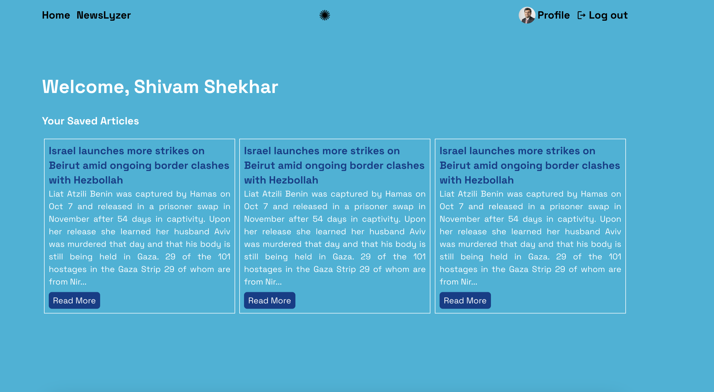

# DIVHACKS 2024

# NewsLyzer

### Live Demo - https://newslyzer.vercel.app/

## 💡 Project Description

NewsLyzer helps you to filter Bias, Sentiment and Deepfake from a news article. It enables you to make a unbiased opinion about any topic.

## Team

| Sr No. | Name           | Email               |
| ------ | -------------- | ------------------- |
| 1      | Shivam Shekhar | ss6960@columbia.edu |
| 2      | Arun           |                     |

## 📺 Preview





## 🏛️ Architecture Diagram

## 📌 Prerequisites

### 💻 System requirement :

1. Any system with basic configuration.
2. Operating System : Any (Windows / Linux / Mac).

### 💿 Software requirement :

1. Updated browser
2. Node.js installed (If not download it [here](https://nodejs.org/en/download/)).
3. FastAPI install (If not downloaded it [here](https://fastapi.tiangolo.com/tutorial/))
4. Any text editor of your choice.

## Installation 🔧

### Client

Client directory

Install dependencies

```
$ yarn install
```

or

```
$ npm install
```

Start the website development server

```
$ yarn dev
```

or

```
$ npm dev
```

### Server

Install Dependencies

```
pip install -r requirements.txt
```

Run the Server

```
uvicorn main:app --reload
```

> Note: Make sure to follow .env.sample and add environment variables.
